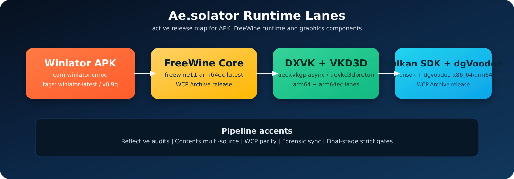

<p align="center">
  
</p>
<p align="center">
  
</p>

# Ae.solator

Android application repository for Ae.solator (`com.winlator.cmod`).

## Scope

- App/UI/runtime binding layer.
- Contents integration and package provenance UX.
- Forensic collection and runtime diagnostics sync for issue bundles.

## Current Mainline State

- App source-of-truth stays in this repository.
- Runtime source-of-truth is `kosoymiki/freewine11`.
- Archive/release orchestration lives in `kosoymiki/wcp-runtime-lanes`.
- Graphics/provider package lanes live in `kosoymiki/wcp-graphics-lanes`.
- `Contents` is expected to expose distinct source provenance (`WCP Archive` vs
  `WCPHub`) instead of collapsing them into one lane.

## Split Model

- `kosoymiki/aesolator`: app source-of-truth.
- `kosoymiki/freewine11`: native FreeWine source tree.
- `kosoymiki/wcp-runtime-lanes` (WCP Archive): Aesolator APK lane + FreeWine + wrapper-backed Vulkan runtime + DXVK + VKD3D + dgVoodoo WCP lanes.
- `kosoymiki/wcp-graphics-lanes`: Turnip/OpenGL provider lanes + build owner for dgVoodoo archive lane.
- `kosoymiki/winlator-wine-proton-arm64ec-wcp`: legacy archived history only.

Legacy donor runtime lanes are not active in Ae.solator.

## Main Workflow

- `.github/workflows/ci-winlator.yml`
  - legacy stub in this repository (disabled mainline build lane).
  - active APK build/release lane runs in `kosoymiki/wcp-runtime-lanes`:
    `.github/workflows/ci-aesolator-apk.yml`.

Legacy CI patch-overlay stack has been removed; this repository stays native source-of-truth for app code, while archive publishing is centralized in WCP Archive.

## Operating Contract

- Repo-local agent rules live in `AGENTS.md`.
- Approval-gated review mode, documentation sync rules, and process gates live
  in `docs/CODEX_OPERATING_CONTRACT.md`.
- The hard master engineering directive lives in
  `docs/MASTER_ENGINEERING_DIRECTIVE.md`.
- If remediation is possible locally, the expected result is an applied
  systemic fix, not advisory-only instructions.

## Local Build

Primary on-device Termux flow:

```sh
sh tools/bootstrap-termux-host.sh
. tools/env-android-local.sh
./gradlew --no-daemon assembleDebug
```

Rules for the authoritative local lane:

- run Gradle from the repo root only
- treat the root wrapper as the source of truth
- do not rely on `app/gradlew` as a separate build lane
- `preBuild` is now deterministic:
  it verifies bundled assets and runtime JNI state,
  but it does not download donor rootfs archives or mutate `src/main/assets`

Legacy CI/helper wrapper:

```bash
bash ci/winlator/ci-build-winlator-ludashi.sh
```

For verified on-device Termux ARM64 local build and Wi-Fi ADB install notes,
see `docs/TERMUX_LOCAL_BUILD.md`.

For the audited extra-runtime cache lane (`VC++ AIO + VC6 legacy`, `Wine Mono`,
`Wine Gecko`, `DirectX June 2010`) and the rootfs-visible prefix toolkit, see
`docs/PREFIX_PACK_TOOLKIT.md`. Repo-side helpers now cover source-bound catalog
inspection, cache fetch, offline-overlay packing, and direct ADB staging into a
live `imagefs`, while the rootfs and Windows loaders keep the same manifest and
Ajay-style `save_data` / log roots.

## Runtime/Graphics Matrix

<p align="center">
  
</p>

## Docs

- `docs/REPO_SPLIT_TOPOLOGY.md`
- `docs/CODEX_OPERATING_CONTRACT.md`
- `docs/CONTENTS_QA_CHECKLIST.md`
- `docs/ADB_HARVARD_DEVICE_FORENSICS.md`
- `docs/AEOLATOR_FORENSIC_SYNC_CONTRACT.md`
- `docs/TERMUX_LOCAL_BUILD.md`
- `docs/PREFIX_PACK_TOOLKIT.md`
- `docs/AJAY_PREFIX_COMPONENT_AUDIT.md`
- `docs/README.md`
- `docs/DONOR_REFLECTIVE_ROADMAP.md`
- `docs/GAMENATIVE_X11_RENDERER_DRIVER_AUDIT.md`
- `docs/GAMENATIVE_FULL_TRANSFER_MATRIX.md`
- `docs/GAMENATIVE_RUNTIME_GAP_INVENTORY.md`
- `docs/GAMENATIVE_LIBWINLATOR11_SOURCE_AUDIT.md`
- `docs/GAMENATIVE_SECOND_SWEEP_INVENTORY.md`
- `docs/IMAGEFS_HYBRID_PLAN.md`
